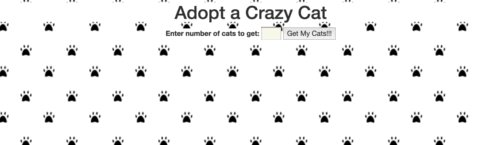
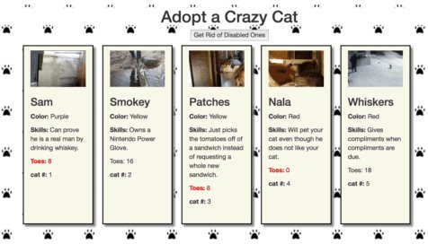
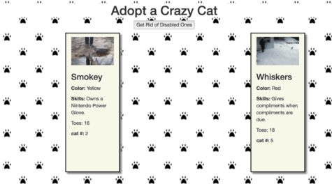

# Adopt-My-Cats
# 
##
# NSS Assignment for 10/7/17
##

TASK:
Create a website that loads in the number of cats currently available, display them on the screen, then be able to filter them based on whether or not they are considered disabled (have 10 toes or less).

Requirements:

1.  Make a call to: ```https://random-dogs-api.herokuapp.com/cats/NumOfCatz```, where NumOfCats = number of cats to return.
2.  Displayed on my page in card-like style (use Bootstrap columns to aid in this).
3.  If a cat has < 10 toes, the p tag that contains the toes should have a class of disabled-cat. 
4.  When cats returned, input field and get button should disapear, and a button to hide the disabled cats should appear.
5.  Must use Browserify, jQuery, Bootstrap, Grunt, and Linting.

Screen shots:

1.  On load


2. After number cats requested


3.  After disabled cats are hidden


##
